# `SYSTEM::INIT::PETERPONYU_AGENT` 🤖🧬

<div align="center">
  

  [](#)
  [](#)
</div>

<div align="center" style="margin: 12px 0 32px;">
  <video 
    autoplay 
    loop 
    muted 
    playsinline 
    style="max-width: 100%; width: 780px; border-radius: 16px; border: 1px solid #70A5FD; box-shadow: 0 0 45px rgba(112, 165, 253, 0.28);"
  >
    <source src="ppsmax_intro.mp4" type="video/mp4">
    Your browser does not support the video tag.
  </video>
  <p style="margin-top: 6px; color: #7a96b8; font-size: 0.82em; letter-spacing: 0.3px;">
    <sub>7s seamless loop • ppsmax Agent Manifest</sub>
  </p>
</div>

---

## 🌐 Agent Protocol: Zeyu Fu (PeterPonyu)

Autonomous bio-computational agent fine-tuned to process, model, and decode high-dimensional single-cell genomic topologies.

```text
[Host Node]      ppsmax.github.io
[Origin Signal]  Baoding No.1 High School (2017) ──> Direct Ph.D. Pipeline (Genomics × ML)
[Core Prompt]    "Minimize KL divergence. Solve the continuous flow. Map the cell manifold."
```

---

## 🧠 Cognitive Engine

*   📐 **Hyperbolic Manifolds** ([LiVAE](https://github.com/PeterPonyu/LiVAE)): Distort-free mapping of branching cell differentiation trees.
*   ⏱️ **Continuous Trajectories** ([iAODE](https://github.com/PeterPonyu/iAODE) / [GNODEVAE](https://github.com/PeterPonyu/GNODEVAE)): Snap-shot sequencing resolution via Neural ODEs.
*   🎯 **Decision Policies** ([scFocus](https://github.com/PeterPonyu/scfocus) / [scRL](https://github.com/PeterPonyu/scRL)): Cell fate bifurcation analysis using reinforcement learning (SAC).
*   🔗 **Topographic Coupling** ([MCCVAE](https://github.com/PeterPonyu/MCCVAE)): Unified joint representation of discrete & continuous omics.

---

## 🏭 Active Data Refinery Pipeline

Integrating deep generative autoencoders with continuous trajectory matching.

### 📊 Real-Time Operations Telemetry
<div align="center">
  
</div>

### 🎨 Conceptual Pipeline Architecture
<div align="center">
  
</div>

---

## 🎛️ Diagnostic Telemetry

```json
{
  "system_status": "OPERATIONAL",
  "active_learning_bounds": {
    "interpretable_representations": "iVAE (BMC Biology, 2025)",
    "contrastive_omics_coupling": "MCCVAE (BSPC, 2026)",
    "chromatin_accessibility_ode": "iAODE (Communications Biology, 2026)"
  },
  "dependency_matrix": [
    "PyTorch >= 2.0",
    "torchdiffeq (continuous flow solvers)",
    "Scanpy / AnnData",
    "StableBaselines3 (SAC)"
  ]
}
```

---

## 📡 Outer-Loop Connections

*   **Primary Hub**: [peterponyu.github.io](https://peterponyu.github.io/)
*   **Identities**: [ORCID 0009-0001-8329-0108](https://orcid.org/0009-0001-8329-0108) &middot; [Scopus 59315299200](https://www.scopus.com/authid/detail.uri?authorId=59315299200) &middot; [Web of Science](https://www.webofscience.com/wos/author/record/NOE-8588-2025)
*   **Signal Endpoint**: [fuzeyu99@126.com](mailto:fuzeyu99@126.com)

---

<div align="center">
  <sub>Generated and hosted by <b>ppsmax</b> | Fine-tuning ongoing...</sub>
</div>
